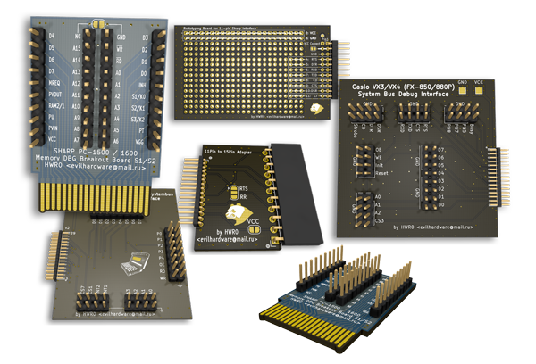

# PokeConDebug
Breakout &amp; Debug Boards for Vintage Pocket Computers (ポケコン) from Casio, Sharp,... and their Accessories 

- <a href="Casio/">Casio Debug Boards</a>

- <a href="Sharp/">Sharp Debug Boards</a>

I'll make some for TRS80 Model100 too, when I get to it
