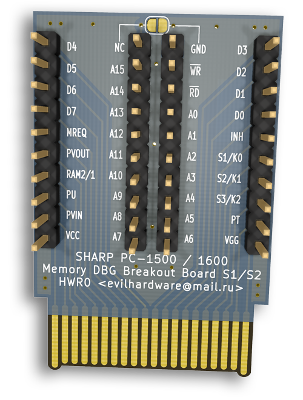
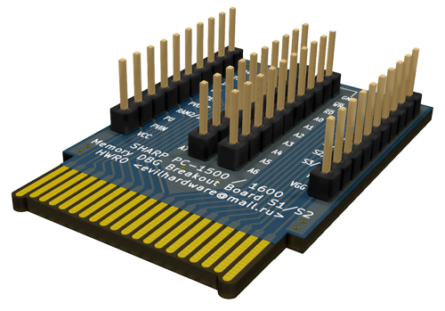
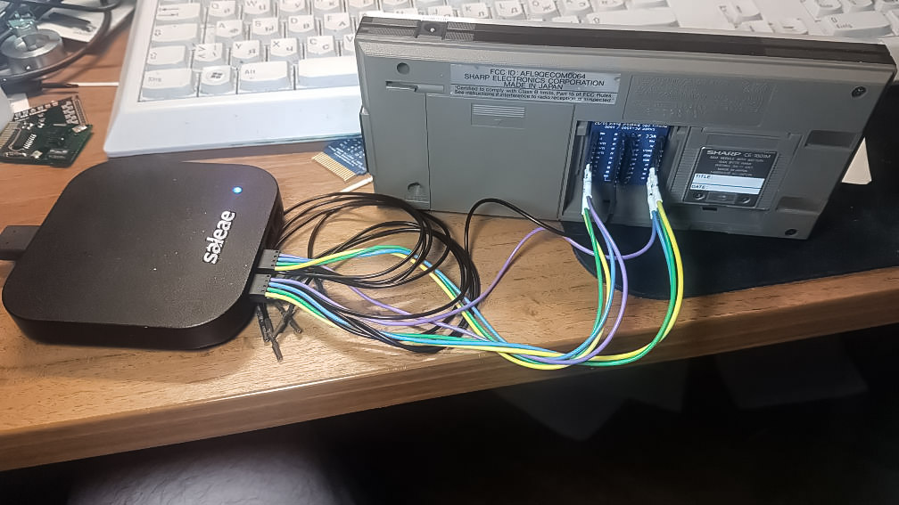

# Sharp Memcard Breakout Board for Sharp PC-1500/PC-1600

**Make sure to fabricate it with a thickness of 1.2mm !**
 

In use:

Sorry, no PDF or Schema: This was my first try at KiCAD, and I did not master the creation of components, especially 2-sided components
